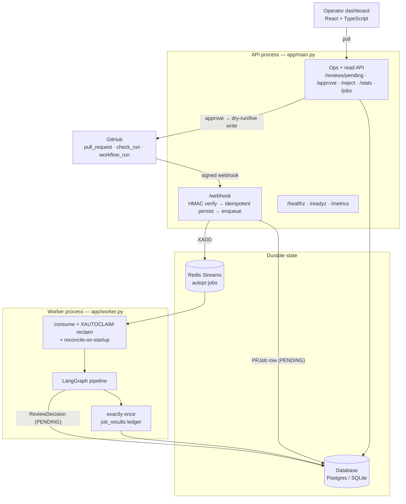
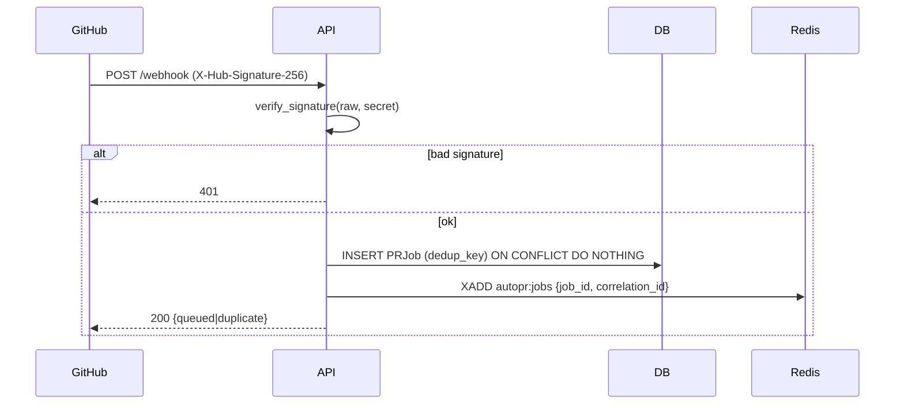
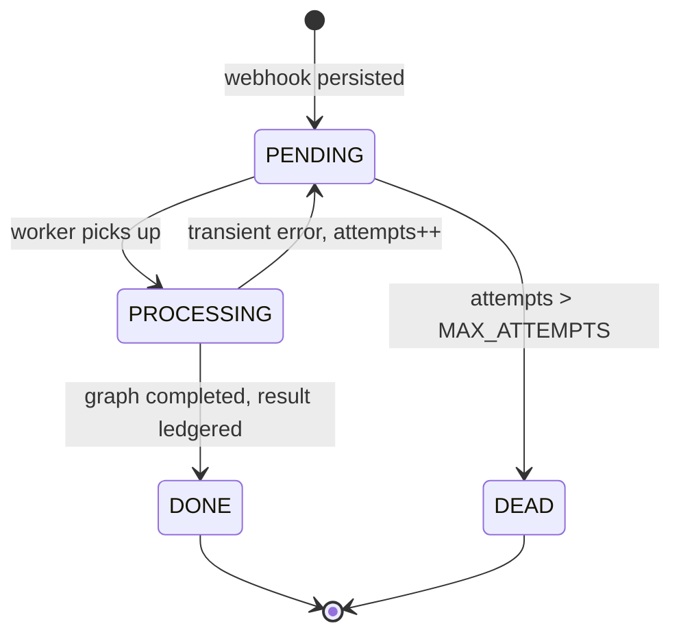
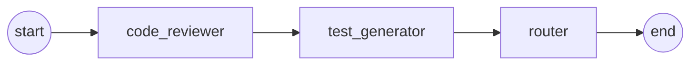
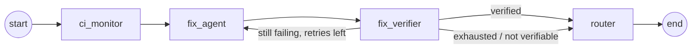

# Architecture

AutoPR is two processes joined by a queue, plus a dashboard. The **API** accepts
GitHub webhooks and serves the operator surface; the **worker** consumes jobs and
runs the agent graph. A relational database is the durable source of truth;
Redis Streams is the delivery mechanism between the two processes.

This document explains how a webhook becomes a reviewed PR or a proposed fix, and
why each seam is built the way it is. For the per-phase rationale (and the
alternatives rejected), see [`decisions/`](decisions/).

---

## 1. Component map

**Why two processes.** The webhook handler must return `200` in milliseconds so
GitHub doesn't time out and retry a delivery that's actually in progress. LLM
work takes seconds. Decoupling them behind a queue means the ingress stays fast
and the slow work happens where it can be retried, reclaimed, and rate-limited
independently of the HTTP request.

---

## 2. The ingress path (synchronous, fast)

`POST /webhook` does only cheap, deterministic work:

1. **Verify the signature** over the *raw* body with `hmac.compare_digest`
   against `AUTOPR_WEBHOOK_SECRET`. Failure → `401`. (`app/security.py`)
2. **Parse** the event. Non-actionable events (a `ping`, a non-PR event) are
   acked with `200` and no work. (`app/ingest.py::parse_event`)
3. **Persist + enqueue idempotently.** A `PRJob` row is written with a unique
   `dedup_key = repo|pr|sha|event`; a duplicate delivery hits the unique
   constraint and is a silent no-op. The row is committed **`PENDING` before**
   the Redis `XADD`, so if the publish fails the job still exists and the
   worker's reconcile will re-enqueue it.
4. **Return** `{"status": "queued"|"duplicate", "job_id": …}` with `200`.

If Redis is unreachable at publish time, the handler returns **503** (not 500):
a `RedisError` here is transient, and 503 tells GitHub to retry the delivery
rather than treating it as a permanent failure.

---

## 3. Delivery + exactly-once processing

Redis Streams gives **at-least-once** delivery: a job can be redelivered if a
worker crashes mid-processing. AutoPR turns that into **effectively-once** with
an idempotent ledger rather than by trying to make delivery exactly-once (which
is impossible in general).

- **Consumer group.** All workers read `autopr:jobs` under one group
  (`autopr-workers`). Redis hands each entry to exactly one consumer and holds it
  in that consumer's Pending Entries List (PEL) until it is `XACK`-ed.
- **Reclaim.** On each loop a worker runs `XAUTOCLAIM` for entries idle longer
  than `AUTOPR_RECLAIM_IDLE_MS`: if a consumer died holding a job, another picks
  it up. (`app/queue.py`)
- **Reconcile on startup.** Any `PRJob` left `PENDING`/`PROCESSING` from a prior
  crash is re-enqueued before the worker begins normal consumption, closing the
  window between "row committed" and "XADD succeeded".
- **The ledger.** `process_job` writes a `JobResult` keyed by `job_id` with
  `INSERT … ON CONFLICT DO NOTHING`. A redelivered job that was already processed
  finds its result row present and short-circuits — the side effects run **once**
  even though the message may arrive more than once. Terminal `DONE`/`DEAD` jobs
  short-circuit immediately.
- **Bounded retry.** Each attempt increments `attempts`; beyond
  `AUTOPR_MAX_ATTEMPTS` the job is parked `DEAD` with `last_error` and never
  retried again.

---

## 4. The agent graph

The worker builds one LangGraph graph (`app/agents/graph.py`) and selects a
track by event type in `make_graph_handler`:

### Track A — PR review (`pull_request`)

- **code_reviewer** reads the changed files (fetched by the GitHub reader) and
  produces a structured review with a risk assessment.
- **test_generator** drafts tests exercising the change.
- **router** turns the review into a *disposition* (see §5).

### Track B — CI fix (`check_run` / `workflow_run`)

- **ci_monitor** classifies the failure (test, lint, type, dependency, …).
- **fix_agent** proposes a patch.
- **fix_verifier** applies the patch to a **snapshot of the repo inside an
  isolated Docker sandbox** and re-runs the failing check. The sandbox runs with
  `--network none`, dropped capabilities, a non-root user, and CPU/memory/PID
  caps (`app/sandbox/`), so an adversarial or runaway patch cannot reach the
  network or exhaust the host. On failure with retries remaining, control loops
  back to `fix_agent` with the sandbox feedback.

Every LLM call is bounded by `AUTOPR_LLM_TIMEOUT_S` and wrapped in a bounded
`tenacity` retry (`app/agents/common.py`), so a hung or flaky model surfaces as a
job error the retry/DEAD machinery already handles — it never wedges a worker.

---

## 5. Routing + the human gate

Both tracks terminate at the `router` node, which calls a **pure function**
`policy.route()` (`app/routing/policy.py`) — no I/O, fully unit-tested — to map
`(action, risk)` to one of:

- **auto-post** — only a *comment* at or below `AUTOPR_AUTO_COMMENT_MAX_RISK`
  (default `low`). A comment changes no code, so low-risk comments post directly
  (subject to the dry-run switch).
- **queue for approval** — anything medium/high risk, and **every code-changing
  action regardless of risk**. A `ReviewDecision` row is written `PENDING`.

Unknown or unparseable risk is treated as high and **fails closed** to the queue.

The queued decision is inert until a human acts on it:

- `GET /reviews/pending` — the work queue (oldest first).
- `POST /reviews/{id}/approve` — **the only path to a real GitHub write.** It
  reconstructs the minimal state and calls `execute_decision`, which goes through
  the GitHub client. With `AUTOPR_GITHUB_DRY_RUN=true` (default) the client
  records the intended action and a synthetic result URL and touches nothing.
  Success → `EXECUTED`; a failed live call → `FAILED` (retryable, never silently
  lost). Every approval emits an `audit.review_approved` log line.
- `POST /reviews/{id}/reject` — marks `REJECTED`; no GitHub action, ever.

This is the invariant the whole system is built to protect: **no agent output
reaches a real repository without a human approving it**, and code changes are
gated unconditionally.

---

## 6. Data model

| Table | Role |
| --- | --- |
| `pr_jobs` | One row per actionable webhook. Carries lifecycle `status`, `attempts`, `last_error`, and the unique `dedup_key`. |
| `job_results` | The **exactly-once ledger**, keyed by `job_id`. Its presence means "this job's side effects have run." |
| `review_decisions` | The human-in-the-loop queue and audit ledger: `action`, `risk`, rendered `title`/`body`, `status` (`PENDING`→`APPROVED`/`EXECUTED`/`REJECTED`/`FAILED`), and `result_url`. |

The same code runs on **Postgres and SQLite** — the only dialect-specific branch
is the `INSERT … ON CONFLICT` construct (`app/db.py::insert_ignore_duplicates`).
SQLite connections get `journal_mode=WAL`, `busy_timeout=5000`, and
`synchronous=NORMAL` so the API and worker can share one file without
"database is locked" errors.

---

## 7. Observability

- **Logs.** One structlog configuration (`app/observability.py`) is called by
  both entrypoints; production emits one JSON object per line.
- **Correlation id.** The API mints (or honours an inbound `X-Request-ID`) a
  short id, binds it into `structlog.contextvars`, and echoes it in the response
  header. `ingest` stamps it onto the Redis message; the worker binds it for the
  life of the job. So every log line for one webhook — across *both* processes —
  shares one id.
- **Health.** `/healthz` is liveness (the process answered). `/readyz` is deep
  readiness (probes DB + Redis) and returns 503 with a per-dependency `checks`
  body when something is down. An orchestrator restarts on liveness failure but
  only stops sending traffic on readiness failure — conflating them is an outage
  amplifier.
- **Metrics.** `/metrics` (Prometheus) exposes HTTP counters/latency (labelled by
  route template, never raw path, to bound cardinality) and pipeline gauges
  (jobs/decisions by status, queue depth) computed from the database at scrape
  time so they can't drift from the source of truth.

---

## 8. What is deliberately not here

Right-sized for a single-operator, 1–50-request showcase:

- **One uvicorn process, one worker** (scale the worker with
  `docker compose up --scale worker=N` to demonstrate concurrent consumption).
  No gunicorn farm, no autoscaler.
- **Correlation ids, not distributed tracing.** No spans/exporter.
- **A single Redis stream**, not partitioned topics.
- **In-process rate limiting**, not a shared token bucket.

Each of these is the right weight for the stated scale and the wrong weight for
web-scale; the scale-out path for every one is written down in the relevant
`docs/decisions/phase-*.md`. That the boundaries are explicit — rather than
absent or hand-waved — is the point.
